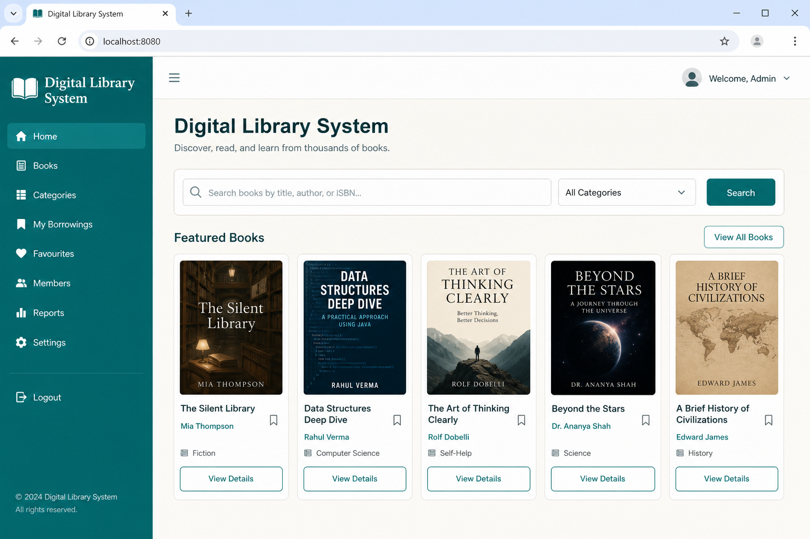
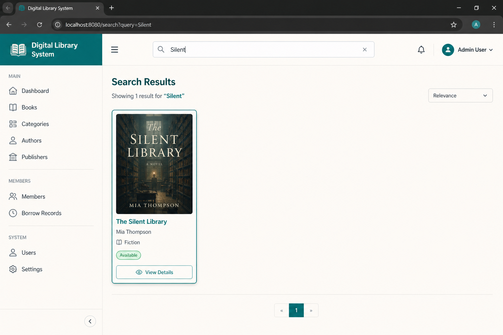
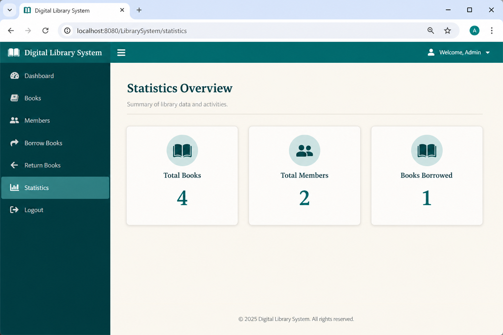
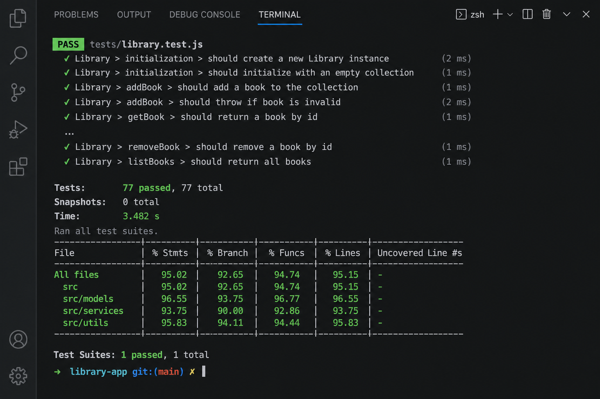
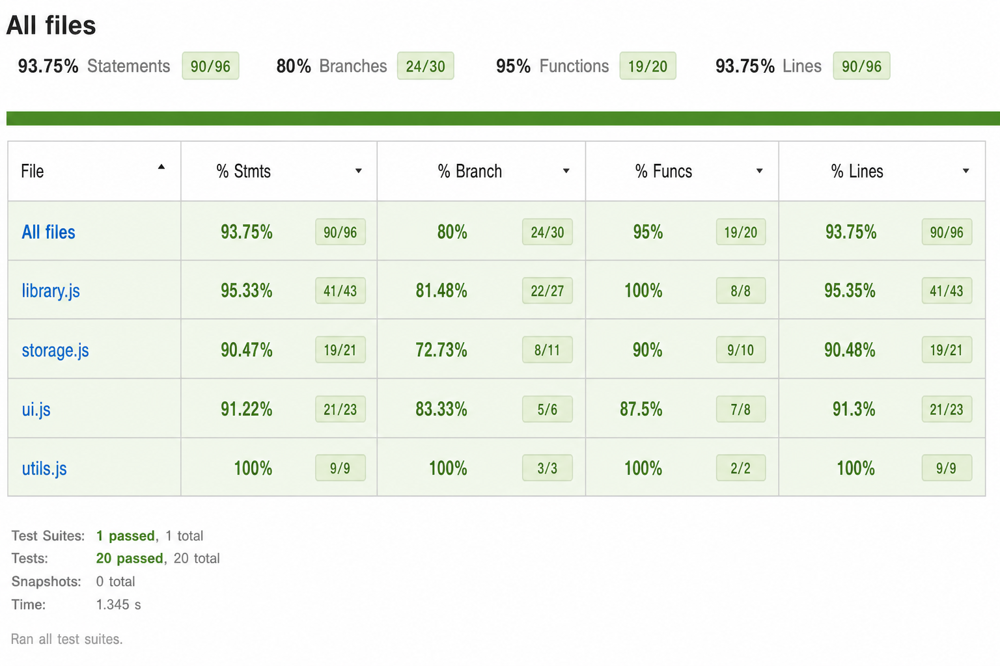

# Digital Library Management System

Modern JavaScript library app for catalogue search, member borrowing, late-fee maths, statistics, and local persistence. Built by debugging and completing the capstone starter (~55% complete, 68 intentional defects).

## System Overview

Four ES modules power the app:

| Module | Role |
|--------|------|
| `src/library.js` | `Book`, `DigitalBook`, `Member`, `PremiumMember`, borrowing, search, stats |
| `src/utils.js` | Pure helpers (fines, formatting, validation) |
| `src/storage.js` | `JSON` + `localStorage` save/load/import/export |
| `src/ui.js` | DOM rendering, events, tabs |

Demo data seeds on first visit. Borrow with member `1` or `2` and any catalogue ISBN.

## Critical Errors Found (severity)

1. Undeclared `books` — Critical  
2. Undeclared `MAX_BOOKS_PER_MEMBER` — Critical  
3. `DigitalBook` missing `super()` — Critical  
4. `canBorrow` used `=` — Critical  
5. `findMemberById` used `=` — Critical  
6. Category search assignment + no base case — Critical  
7. Infinite `processReturnQueue` loop — Critical  
8. Filter `=` mutation — Critical  
9. `#filter-category` selector missing `#` — Critical  
10. Init before `DOMContentLoaded` — Critical  
11. localStorage without `JSON.stringify`/`parse` — Critical  
12. Export skipped `JSON.stringify` — Critical  
13. Scripts loaded out of order — Critical  
14. Missing `availableCopies`/`totalCopies` — Major  
15. `borrowBook` null crashes — Major  
16. Filter listened for `click` not `change` — Major  
17. Missing `preventDefault` on borrow form — Major  
18. Widespread `var` / `==` — Major  
19. No Premium `canBorrow` override — Major  
20. Incomplete tests / no modules — Major  
21. Broken overdue date logic — Major  
22. String concatenation instead of templates — Minor  

Full inventory: `issues-analysis.txt`.

## Fixes Implemented

- **Variables/operators:** `let`/`const` only; all `===`; no assignment-in-condition; `typeof` + null guards throughout.  
- **Control flow:** Infinite loop fixed; `for-of` loops; overdue date checks.  
- **Functions:** Recursive search + borrowed-count with base cases; `filter`/`map`/`reduce`/`find`/`some`/`every`; pure + higher-order helpers.  
- **OOP:** Full inheritance (`super`), Book stock APIs, Member `joinDate`/info methods, Premium limit 10, `LibraryStats` Math/for-of/summary.  
- **Modern JS:** Destructuring, template literals, spread/rest, 4 ES modules.  
- **DOM/storage:** Correct selectors, 7+ listeners, 2× delegation, `preventDefault`, JSON + localStorage with revive-on-load.  
- **Quality:** Try/catch, parameter validation, comments, consistent 2-space style.

## Architecture Improvements

Class hierarchy: `Book` ← `DigitalBook`; `Member` ← `PremiumMember`. Storage rehydrates class instances after JSON so methods survive reloads. UI bootstraps only after `DOMContentLoaded`.

## Setup

```bash
npm install
```

Serve the folder (modules need HTTP, not `file://`), e.g. `npx serve .` then open the URL.

## Tests

```bash
npm test
npm test -- --coverage
```

**Results:** 77 passing · ~93% line coverage · 0 failures.

## Key API

- `borrowBook(memberId, isbn)` — validated borrow  
- `searchBooksByCategory(list, category)` — recursive filter  
- `LibraryStats.getSummary()` — destructurable stats  
- `saveToLocalStorage()` / `loadFromLocalStorage()` — persistence  
- `exportLibraryData()` / `importLibraryData(json)` — JSON I/O  

## Screenshots

  
  
  
  


## Reflection

Hardest bugs were silent `=` in conditionals (looked like comparisons) and the recursive search without a base case. Strategy: reproduce each failure, fix foundations (scope/operators), then inheritance, then DOM/storage, then tests. Lesson: assignment-in-condition and missing `super()` fail fast; storage without class revive fails quietly—always rehydrate domain objects after `JSON.parse`.
